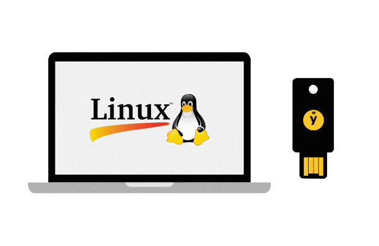

This method will work with ANY security keys that support the U2F standard

<!--truncate-->

## Prerequisites

* A Security key supporting the U2F Standard
* Linux
* root access to the System you are gonna configure 2FA for

## Installation the pam-u2f

### Arch Linux

`sudo pacman -Sy --needed pam-u2f`

### Debian/Ubuntu

`sudo apt update && sudo apt install libpam-u2f`

### Source code

[Github](https://github.com/Yubico/pam-u2f)

## Configure Security keys

The `pam-u2f` package provides a handy tool to configure Security Keys for our users called `pamu2fcfg`

```text  title="pamu2fcfg --help"
Usage: pamu2fcfg [OPTION]...
Perform a FIDO2/U2F registration operation and print a configuration line that
can be used with the pam_u2f module.

  -h, --help               Print help and exit
      --version            Print version and exit
  -o, --origin=STRING      Relying party ID to use during registration,
                             defaults to pam://hostname
  -i, --appid=STRING       Relying party name to use during registration,
                             defaults to the value of origin
  -t, --type=STRING        COSE type to use during registration (ES256, EDDSA,
                             or RS256), defaults to ES256
  -r, --resident           Generate a resident (discoverable) credential
  -P, --no-user-presence   Allow the credential to be used without ensuring the
                             user's presence
  -N, --pin-verification   Require PIN verification during authentication
  -V, --user-verification  Require user verification during authentication
  -d, --debug              Print debug information
  -v, --verbose            Print information about chosen origin and appid
  -u, --username=STRING    The name of the user registering the device,
                             defaults to the current user name
  -n, --nouser             Print only registration information (key handle,
                             public key, and options), useful for appending

Report bugs at <https://github.com/Yubico/pam-u2f/issues>.
```

### Individual Authorization Mapping by User

1. Create folder:

    `mkdir -p ~/.config/Yubico`

2. Make user keys:

    `pamu2fcfg > ~/.config/Yubico/u2f_keys`

    2.1 Add Additional keys using

    `pamu2fcfg >> ~/.config/Yubico/u2f_keys`

_pamu2fcfg example output:_

 ```text title="~/.config/Yubico/u2f_keys"
 username:1pQTIDIGWLfyRhYjiFpJeSlSxN4fqdY0ucl59VxQdS0qV9QxDgb5HGL1Hd18o1gQ1wr9B3BP60tk4735JrIE7A==,KPMgCkrhND9yMKaImqwgywBVJlIHc8rDUVbMirXCG70X+bzld/a6HWOjaSlzUXinVp3yfofx96wgmSWkGX6poQ==,es256,+presence
 ```

### Central Authorization Mapping

Create a file e.g. `/etc/u2f_mappings`. The file must contain a user name, and the information obtained during the registration procedure.

`pamu2fcfg -u username1 >> /etc/u2f_mappings`

## Activate the pam_u2f.so module in PAM

Configure pam-u2f as a `required` module after your primary authentication module(s) for use as a second factor. Make sure that the primary authentication method is not `sufficient` or uses other control values that may preempt execution of pam-u2f.

### Dealing with SDDM

1. For correctly work SDDM with U2F, need to change `system-login` to `system-local-login` into `/etc/pam.d/sddm` Failing to do this will result in the KDE lock screen, and terminal access requiring U2F, but the initial login via SDDM bypassing U2F, which defeats the purpose of having two factor authentication.
2. Add the following line to config file (change `username`)

    `auth            required        pam_u2f.so authfile=/home/<username>/.config/Yubico/u2f_keys`

sddm config **before** adding U2F:

```text title="/etc/pam.d/sddm"
#%PAM-1.0

auth           include         system-login
-auth           optional        pam_gnome_keyring.so
-auth   optional  pam_kwallet5.so

account         include         system-login

password        include         system-login
-password       optional        pam_gnome_keyring.so use_authtok

session         optional        pam_keyinit.so force revoke
session         include         system-login
-session                optional        pam_gnome_keyring.so auto_start
-session  optional  pam_kwallet5.so auto_start
```

sddm config **after** adding U2F:

```text title="/etc/pam.d/sddm"
#%PAM-1.0

// highlight-next-line
auth            include         system-local-login
-auth           optional        pam_gnome_keyring.so
-auth   optional  pam_kwallet5.so
// highlight-next-line
auth            required        pam_u2f.so authfile=/home/<username>/.config/Yubico/u2f_keys

account         include         system-login

password        include         system-login
-password       optional        pam_gnome_keyring.so use_authtok

session         optional        pam_keyinit.so force revoke
session         include         system-login
-session                optional        pam_gnome_keyring.so auto_start
-session  optional  pam_kwallet5.so auto_start
```

:::tip

Add the same version to the top of `/etc/pam.d/kde` to protect the KDE Plasma lock screen.

`auth            required        pam_u2f.so authfile=/home/<username>/.config/Yubico/u2f_keys`

:::

:::info PAM Configuration (Reference)

<details>
  <summary>PAM Configuration File Syntax</summary>

The entries in the configuration file are in the format:

**`service-name module-type control-flag module-path module-options`**

---

**service-name** - Name of the service, for example, `ftp`, `login`, or `passwd`. An application can use different service names for the services that the application provides. For example, the Solaris secure shell daemon uses these service names: `sshd-none`, `sshd-password`, `sshd-kbdint`, `sshd-pubkey`, and `sshd-hostbased`. The service-name other is a predefined name that is used as a wildcard service-name. If a particular service-name is not found in the configuration file, the configuration for other is used.

**module-type** - The type of service, that is, auth, account, session, or password.

**control-flag** - Indicates the role of the module in determining the integrated success or failure value for the service. Valid control flags are binding, include, optional, required, requisite, and sufficient. See below how PAM Stacking Works for information on the use of these flags.

**module-path** - The path to the library object that implements the service. If the pathname is not absolute, the pathname is assumed to be relative to `/usr/lib/security/$ISA/`. Use the architecture-dependent macro $ISA to cause `libpam` to look in the directory for the particular architecture of the application.

**module-options** - Options that are passed to the service modules. A module's man page describes the options that are accepted by that module. Typical module options include `nowarn` and `debug`.
</details>

<details>
  <summary>How PAM Stacking Works</summary>

The control flag indicates the role that a PAM module plays in determining access to the service. The control flags and their effects are:

**Binding** – Success in meeting a binding module's requirements returns success immediately to the application if no previous required modules have failed. If these conditions are met, then no further execution of modules occurs. Failure causes a required failure to be recorded and the processing of modules to be continued.

**Include** – Adds lines from a separate PAM configuration file to be used at this point in the PAM stack. This flag does not control success or failure behaviors. When a new file is read, the PAM include stack is incremented. When the stack check in the new file finishes, the include stack value is decremented. When the end of a file is reached and the PAM include stack is 0, then the stack processing ends. The maximum number for the PAM include stack is 32.

**Optional** – Success in meeting an optional module's requirements is not necessary for using the service. Failure causes an optional failure to be recorded.

**Required** – Success in meeting a required module's requirements is necessary for using the service. Failure results in an error return after the remaining modules for this service have been executed. Final success for the service is returned only if no binding or required modules have reported failures.

**Requisite** – Success in meeting a requisite module's requirements is necessary for using the service. Failure results in an immediate error return with no further execution of modules. All requisite modules for a service must return success for the function to be able to return success to the application.

**Sufficient** – If no previous required failures have occurred, success in a sufficient module returns success to the application immediately with no further execution of modules. Failure causes an optional failure to be recorded.

The following two diagrams shows how access is determined in the integration process. The first diagram indicates how success or failure is recorded for each type of control flag. The second diagram shows how the integrated value is determined.

**_Effect of Control Flags_**


**_How Integrated Value Is Determined_**


</details>

:::

### Passwordless sudo with U2F

You can use U2F key for Passwordless sudo i.e only the U2f key would be needed to run sudo commands

We can achieve this by editing the `/etc/pam.d/sudo` file

Add the following line to the TOP of the sudo file

`auth            sufficient        pam_u2f.so authfile=/home/<username>/.config/Yubico/u2f_keys cue [cue_prompt=<Prompt we want to show to our users>]`

Example:

```text title="/etc/pam.d/sudo"
#%PAM-1.0
// highlight-next-line
auth            sufficient        pam_u2f.so authfile=/home/<username>/.config/Yubico/u2f_keys cue [cue_prompt=Please Confirm Your Identity.]
auth            include         system-auth
account         include         system-auth
session         include         system-auth

```

## SSH Credentials

To generate SSH credentials OpenSSH version 8.2 or later is required. It is then possible to generate a credential file with:

`ssh-keygen -t ecdsa-sk -f ./.ssh/filename`

or

`ssh-keygen -t ed25519-sk -f ./.ssh/filename`

## Additional information

:::info

* [YubiKey Manager AppImage](https://developers.yubico.com/yubikey-manager-qt/Releases/yubikey-manager-qt-latest-linux.AppImage)
* [pam-u2f](https://github.com/Yubico/pam-u2f)
* [PAM base-stack in Arch Linux](https://wiki.archlinux.org/title/PAM#PAM_base-stack)
* [Linux user authentication with PAM](https://wiki.archlinux.org/title/YubiKey#Linux_user_authentication_with_PAM)
* [More information for module arguments](https://github.com/Yubico/pam-u2f#module-arguments)
* [YubiKey Full Disk Encryption](https://github.com/agherzan/yubikey-full-disk-encryption)
* [Installing Yubico Software on Linux](https://support.yubico.com/hc/en-us/articles/360016649039-Installing-Yubico-Software-on-Linux)
* [Using Your U2F YubiKey with Linux](https://support.yubico.com/hc/en-us/articles/360013708900-Using-Your-U2F-YubiKey-with-Linux)
* [Yubico Support](https://support.yubico.com/)

:::
