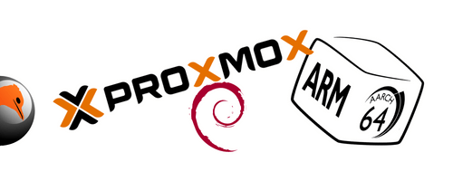

import BrowserWindow from '@site/src/components/BrowserWindow';



<!--truncate-->

<BrowserWindow>

```text title="nano /etc/pve/qemu-server/124.conf"
// highlight-yellow
#vmgenid%3A 0e34fef6-0336-4748-86f8-314346f2d087
// highlight-green
arch: aarch64
bios: ovmf
boot: order=scsi2;scsi0;net0
cores: 4
memory: 2048
meta: creation-qemu=7.1.0,ctime=1670353758
name: arm
net0: e1000=0A:57:71:2D:2C:88,bridge=vmbr0,firewall=1
numa: 0
ostype: l26
scsi0: raid:124/vm-124-disk-0.qcow2,size=32G
scsi2: raid:iso/debian-11.5.0-arm64-netinst.iso,media=cdrom,size=329004K
scsihw: virtio-scsi-pci
serial0: socket
smbios1: uuid=998276ea-30eb-4bd1-b255-e9691ee5a96e
sockets: 1
vga: serial0
```
</BrowserWindow>
