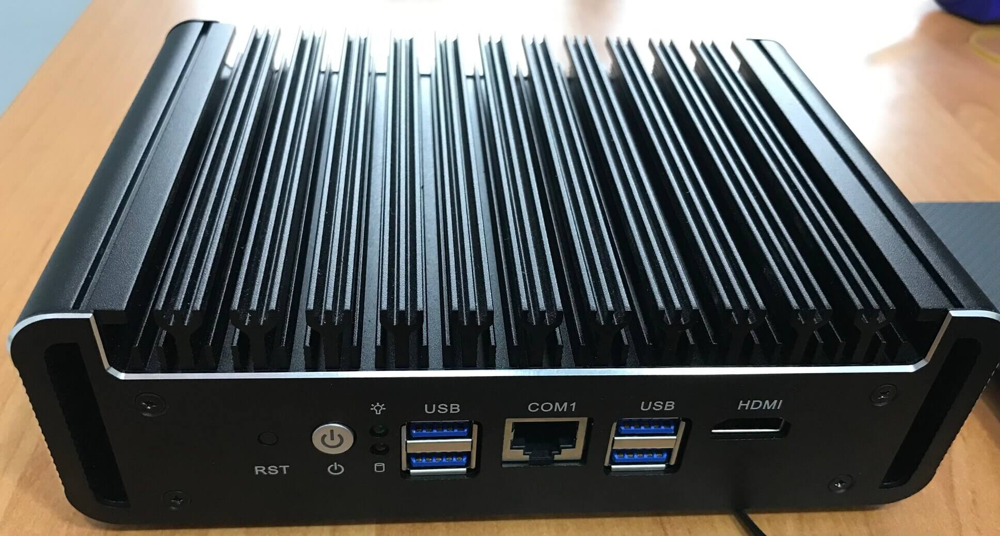

import BrowserWindow from '@site/src/components/BrowserWindow';



<!--truncate-->


## Hardware

### Specification

|                   |                                                                                                          |
|:-----------------:|:--------------------------------------------------------------------------------------------------------|
| **CPU**           | 11th Gen Intel(R) Core(TM) i7-1165G7 @ 2.80GHz / Intel Iris Xe Graphics  1.30 GHz                        |
| **RAM**           | 8GB 2667MT/s (PN: HMA81GS6CJR8N-VK) [2xDDR4 SODIMM/MAX 64Gb]                                             |
| **NVMe**          | Fanxiang S500 128GB (SN: FXS500222900092/FW Rev: U0521A0)                                                |
| **Network**       | 6x Intel i225-V B3 2,5G RJ45 LANs (Intel S1293L29-SLNMH)                                                                        |
| **Power Adapter** | 12V-5A (60W) [12-19V ]                                                                                   |
| **Other**         | 4xUSB3.0, 1xRJ45 COM, 1xHDMI2.0 4K @ 60Hz UHD, 1xM.2 2242/2280 NVMe/PCIE3.0x4 SSD + 1x2.5''SATA SSD/HDD. |
| **Other**         | 1xSIM слот, 1xMPCIE wireless slot, support WiFi/3G/4G (choice of 1 of 3), SYS_FAN and CPU_FAN 3pins 5V, AMI bios                      |
| **Price**         | AliExpress $550                                                                                          |

### Photos

<details>
  <summary>Detail photos</summary>

**Network chip:**


**CPU_FAN 5V:**


</details>

## Benchmarks

### sbc-bench without Fan

* [Link ix.io](http://ix.io/4nmo)

### sbc-bench with SYS_FAN 120mm (550 RPM)

* [Link ix.io](http://ix.io/4nxi)
* [Test geekbench.com](https://browser.geekbench.com/v5/cpu/20462120)
* [Test geekbench full results](http://ix.io/4nCj)

### sbc-bench with SYS_FAN 120mm (550 RPM) temp outside -1 degree Celsius

* [Link ix.oi](http://ix.io/4nCV)

### Summary

| Device / details | Clockspeed | Kernel | Distro | 7-zip multi | 7-zip single | AES | memcpy | memset | kH/s | Comment |
| ----- | :--------: | :----: | :----: | ----: | ------: | ------: | -----: | -----: | ---: | :--- |
|  i7-1165G7 @ 2.80GHz | ~4520 | 5.4 | Ubuntu 20.04.5 LTS x86_64/amd64 | 20420 | 4702 | 1501600 | 9890 | 19780 | 71.53 | without Fan |
|  i7-1165G7 @ 2.80GHz | ~4460 | 5.4 | Ubuntu 20.04.5 LTS x86_64/amd64 | 20790 | 5111 | 1565430 | 9570 | 19440 | 73.96 | with SYS_FAN 120mm (550 RPM) |
|  i7-1165G7 @ 2.80GHz | 4700  | 5.4 | Ubuntu 20.04.5 LTS x86_64/amd64 | 22050 | 5475 | 1666320 | 16930 | 38630 | 77.12 | with SYS_FAN 120mm (550 RPM) temp outside -1 degree Celsius and dual-channel RAM |

## PCI info

<details>
  <summary>lspci -Qv</summary>

<BrowserWindow>

```yaml
00:00.0 Host bridge: Intel Corporation 11th Gen Core Processor Host Bridge/DRAM Registers (rev 01)
        DeviceName: Onboard - Other
        Subsystem: Intel Corporation Device 7270
        Flags: bus master, fast devsel, latency 0
        Capabilities: [e0] Vendor Specific Information: Len=14 <?>

00:02.0 VGA compatible controller: Intel Corporation TigerLake-LP GT2 [Iris Xe Graphics] (rev 01) (prog-if 00 [VGA controller])
        DeviceName: Onboard - Video
        Subsystem: Intel Corporation Device 2212
        Flags: bus master, fast devsel, latency 0, IRQ 255
        Memory at 6000000000 (64-bit, non-prefetchable) [size=16M]
        Memory at 4000000000 (64-bit, prefetchable) [size=256M]
        I/O ports at 3000 [size=64]
        Expansion ROM at 000c0000 [virtual] [disabled] [size=128K]
        Capabilities: [40] Vendor Specific Information: Len=0c <?>
        Capabilities: [70] Express Root Complex Integrated Endpoint, MSI 00
        Capabilities: [ac] MSI: Enable- Count=1/1 Maskable+ 64bit-
        Capabilities: [d0] Power Management version 2
        Capabilities: [100] Process Address Space ID (PASID)
        Capabilities: [200] Address Translation Service (ATS)
        Capabilities: [300] Page Request Interface (PRI)
        Capabilities: [320] Single Root I/O Virtualization (SR-IOV)
        Kernel modules: i915

00:06.0 PCI bridge: Intel Corporation 11th Gen Core Processor PCIe Controller (rev 01) (prog-if 00 [Normal decode])
        Flags: bus master, fast devsel, latency 0, IRQ 122
        Bus: primary=00, secondary=01, subordinate=01, sec-latency=0
        I/O behind bridge: [disabled]
        Memory behind bridge: 51600000-516fffff [size=1M]
        Prefetchable memory behind bridge: [disabled]
        Capabilities: [40] Express Root Port (Slot+), MSI 00
        Capabilities: [80] MSI: Enable+ Count=1/1 Maskable- 64bit-
        Capabilities: [90] Subsystem: Intel Corporation Device 7270
        Capabilities: [a0] Power Management version 3
        Capabilities: [100] Advanced Error Reporting
        Capabilities: [220] Access Control Services
        Capabilities: [150] Precision Time Measurement
        Capabilities: [280] Virtual Channel
        Capabilities: [a00] Downstream Port Containment
        Capabilities: [a30] Secondary PCI Express
        Capabilities: [a90] Data Link Feature <?>
        Capabilities: [a9c] Physical Layer 16.0 GT/s <?>
        Capabilities: [edc] Lane Margining at the Receiver <?>
        Kernel driver in use: pcieport

00:0a.0 Signal processing controller: Intel Corporation Tigerlake Telemetry Aggregator Driver (rev 01)
        DeviceName: Onboard - Other
        Subsystem: Intel Corporation Device 7270
        Flags: fast devsel
        Memory at 6001120000 (64-bit, non-prefetchable) [size=32K]
        Capabilities: [70] Express Root Complex Integrated Endpoint, MSI 00
        Capabilities: [d0] Power Management version 3
        Capabilities: [100] Designated Vendor-Specific <?>
        Capabilities: [110] Designated Vendor-Specific <?>
        Capabilities: [120] Designated Vendor-Specific <?>

00:0d.0 USB controller: Intel Corporation Tiger Lake-LP Thunderbolt 4 USB Controller (rev 01) (prog-if 30 [XHCI])
        DeviceName: Onboard - Other
        Subsystem: Intel Corporation Device 7270
        Flags: bus master, medium devsel, latency 0, IRQ 131
        Memory at 6001110000 (64-bit, non-prefetchable) [size=64K]
        Capabilities: [70] Power Management version 2
        Capabilities: [80] MSI: Enable+ Count=1/8 Maskable- 64bit+
        Capabilities: [90] Vendor Specific Information: Len=14 <?>
        Capabilities: [b0] Vendor Specific Information: Len=00 <?>
        Kernel driver in use: xhci_hcd

00:14.0 USB controller: Intel Corporation Tiger Lake-LP USB 3.2 Gen 2x1 xHCI Host Controller (rev 20) (prog-if 30 [XHCI])
        DeviceName: Onboard - Other
        Subsystem: Intel Corporation Device 7270
        Flags: bus master, medium devsel, latency 0, IRQ 132
        Memory at 6001100000 (64-bit, non-prefetchable) [size=64K]
        Capabilities: [70] Power Management version 2
        Capabilities: [80] MSI: Enable+ Count=1/8 Maskable- 64bit+
        Capabilities: [90] Vendor Specific Information: Len=14 <?>
        Capabilities: [b0] Vendor Specific Information: Len=00 <?>
        Kernel driver in use: xhci_hcd

00:14.2 RAM memory: Intel Corporation Tiger Lake-LP Shared SRAM (rev 20)
        DeviceName: Onboard - Other
        Subsystem: Intel Corporation Device 7270
        Flags: fast devsel
        Memory at 600112c000 (64-bit, non-prefetchable) [disabled] [size=16K]
        Memory at 6001132000 (64-bit, non-prefetchable) [disabled] [size=4K]
        Capabilities: [80] Power Management version 3

00:16.0 Communication controller: Intel Corporation Tiger Lake-LP Management Engine Interface (rev 20)
        DeviceName: Onboard - Other
        Subsystem: Intel Corporation Device 7270
        Flags: bus master, fast devsel, latency 0, IRQ 173
        Memory at 6001131000 (64-bit, non-prefetchable) [size=4K]
        Capabilities: [50] Power Management version 3
        Capabilities: [8c] MSI: Enable+ Count=1/1 Maskable- 64bit+
        Capabilities: [a4] Vendor Specific Information: Len=14 <?>
        Kernel driver in use: mei_me
        Kernel modules: mei_me

00:17.0 SATA controller: Intel Corporation Tiger Lake-LP SATA Controller (rev 20) (prog-if 01 [AHCI 1.0])
        DeviceName: Onboard - SATA
        Subsystem: Intel Corporation Device 7270
        Flags: bus master, 66MHz, medium devsel, latency 0, IRQ 133
        Memory at 51700000 (32-bit, non-prefetchable) [size=8K]
        Memory at 51703000 (32-bit, non-prefetchable) [size=256]
        I/O ports at 3090 [size=8]
        I/O ports at 3080 [size=4]
        I/O ports at 3060 [size=32]
        Memory at 51702000 (32-bit, non-prefetchable) [size=2K]
        Capabilities: [80] MSI: Enable+ Count=1/1 Maskable- 64bit-
        Capabilities: [70] Power Management version 3
        Capabilities: [a8] SATA HBA v1.0
        Kernel driver in use: ahci
        Kernel modules: ahci

00:1c.0 PCI bridge: Intel Corporation Device a0bc (rev 20) (prog-if 00 [Normal decode])
        Flags: bus master, fast devsel, latency 0, IRQ 123
        Bus: primary=00, secondary=02, subordinate=05, sec-latency=0
        I/O behind bridge: [disabled]
        Memory behind bridge: 51300000-515fffff [size=3M]
        Prefetchable memory behind bridge: [disabled]
        Capabilities: [40] Express Root Port (Slot+), MSI 00
        Capabilities: [80] MSI: Enable+ Count=1/1 Maskable- 64bit-
        Capabilities: [90] Subsystem: Intel Corporation Device 7270
        Capabilities: [a0] Power Management version 3
        Capabilities: [100] Advanced Error Reporting
        Capabilities: [220] Access Control Services
        Capabilities: [150] Precision Time Measurement
        Capabilities: [a30] Secondary PCI Express
        Capabilities: [a00] Downstream Port Containment
        Kernel driver in use: pcieport

00:1c.5 PCI bridge: Intel Corporation Tigerlake PCH-LP PCI Express Root Port #6 (rev 20) (prog-if 00 [Normal decode])
        Flags: bus master, fast devsel, latency 0, IRQ 124
        Bus: primary=00, secondary=06, subordinate=06, sec-latency=0
        I/O behind bridge: [disabled]
        Memory behind bridge: 51000000-512fffff [size=3M]
        Prefetchable memory behind bridge: [disabled]
        Capabilities: [40] Express Root Port (Slot+), MSI 00
        Capabilities: [80] MSI: Enable+ Count=1/1 Maskable- 64bit-
        Capabilities: [90] Subsystem: Intel Corporation Device 7270
        Capabilities: [a0] Power Management version 3
        Capabilities: [100] Advanced Error Reporting
        Capabilities: [220] Access Control Services
        Capabilities: [150] Precision Time Measurement
        Capabilities: [a30] Secondary PCI Express
        Capabilities: [a00] Downstream Port Containment
        Kernel driver in use: pcieport

00:1c.6 PCI bridge: Intel Corporation Device a0be (rev 20) (prog-if 00 [Normal decode])
        Flags: bus master, fast devsel, latency 0, IRQ 125
        Bus: primary=00, secondary=07, subordinate=07, sec-latency=0
        I/O behind bridge: [disabled]
        Memory behind bridge: 50d00000-50ffffff [size=3M]
        Prefetchable memory behind bridge: [disabled]
        Capabilities: [40] Express Root Port (Slot+), MSI 00
        Capabilities: [80] MSI: Enable+ Count=1/1 Maskable- 64bit-
        Capabilities: [90] Subsystem: Intel Corporation Device 7270
        Capabilities: [a0] Power Management version 3
        Capabilities: [100] Advanced Error Reporting
        Capabilities: [220] Access Control Services
        Capabilities: [150] Precision Time Measurement
        Capabilities: [a30] Secondary PCI Express
        Capabilities: [a00] Downstream Port Containment
        Kernel driver in use: pcieport

00:1c.7 PCI bridge: Intel Corporation Tiger Lake-LP PCI Express Root Port #8 (rev 20) (prog-if 00 [Normal decode])
        Flags: bus master, fast devsel, latency 0, IRQ 126
        Bus: primary=00, secondary=08, subordinate=08, sec-latency=0
        I/O behind bridge: [disabled]
        Memory behind bridge: 50a00000-50cfffff [size=3M]
        Prefetchable memory behind bridge: [disabled]
        Capabilities: [40] Express Root Port (Slot+), MSI 00
        Capabilities: [80] MSI: Enable+ Count=1/1 Maskable- 64bit-
        Capabilities: [90] Subsystem: Intel Corporation Device 7270
        Capabilities: [a0] Power Management version 3
        Capabilities: [100] Advanced Error Reporting
        Capabilities: [220] Access Control Services
        Capabilities: [150] Precision Time Measurement
        Capabilities: [a30] Secondary PCI Express
        Capabilities: [a00] Downstream Port Containment
        Kernel driver in use: pcieport

00:1d.0 PCI bridge: Intel Corporation Tiger Lake-LP PCI Express Root Port #9 (rev 20) (prog-if 00 [Normal decode])
        Flags: bus master, fast devsel, latency 0, IRQ 127
        Bus: primary=00, secondary=09, subordinate=09, sec-latency=0
        I/O behind bridge: [disabled]
        Memory behind bridge: 50700000-509fffff [size=3M]
        Prefetchable memory behind bridge: [disabled]
        Capabilities: [40] Express Root Port (Slot+), MSI 00
        Capabilities: [80] MSI: Enable+ Count=1/1 Maskable- 64bit-
        Capabilities: [90] Subsystem: Intel Corporation Device 7270
        Capabilities: [a0] Power Management version 3
        Capabilities: [100] Advanced Error Reporting
        Capabilities: [220] Access Control Services
        Capabilities: [150] Precision Time Measurement
        Capabilities: [a30] Secondary PCI Express
        Capabilities: [a00] Downstream Port Containment
        Kernel driver in use: pcieport

00:1d.1 PCI bridge: Intel Corporation Device a0b1 (rev 20) (prog-if 00 [Normal decode])
        Flags: bus master, fast devsel, latency 0, IRQ 128
        Bus: primary=00, secondary=0a, subordinate=0a, sec-latency=0
        I/O behind bridge: [disabled]
        Memory behind bridge: 50400000-506fffff [size=3M]
        Prefetchable memory behind bridge: [disabled]
        Capabilities: [40] Express Root Port (Slot+), MSI 00
        Capabilities: [80] MSI: Enable+ Count=1/1 Maskable- 64bit-
        Capabilities: [90] Subsystem: Intel Corporation Device 7270
        Capabilities: [a0] Power Management version 3
        Capabilities: [100] Advanced Error Reporting
        Capabilities: [220] Access Control Services
        Capabilities: [150] Precision Time Measurement
        Capabilities: [a30] Secondary PCI Express
        Capabilities: [a00] Downstream Port Containment
        Kernel driver in use: pcieport

00:1f.0 ISA bridge: Intel Corporation Tiger Lake-LP LPC Controller (rev 20)
        DeviceName: Onboard - Other
        Subsystem: Intel Corporation Device 7270
        Flags: bus master, fast devsel, latency 0

00:1f.3 Audio device: Intel Corporation Tiger Lake-LP Smart Sound Technology Audio Controller (rev 20)
        DeviceName: Onboard - Sound
        Subsystem: Intel Corporation Device 7270
        Flags: fast devsel, IRQ 16
        Memory at 6001128000 (64-bit, non-prefetchable) [size=16K]
        Memory at 6001000000 (64-bit, non-prefetchable) [size=1M]
        Capabilities: [50] Power Management version 3
        Capabilities: [80] Vendor Specific Information: Len=14 <?>
        Capabilities: [60] MSI: Enable- Count=1/1 Maskable- 64bit+
        Kernel driver in use: snd_hda_intel
        Kernel modules: snd_hda_intel, snd_sof_pci

00:1f.4 SMBus: Intel Corporation Tiger Lake-LP SMBus Controller (rev 20)
        DeviceName: Onboard - Other
        Subsystem: Intel Corporation Device 7270
        Flags: medium devsel, IRQ 16
        Memory at 6001130000 (64-bit, non-prefetchable) [size=256]
        I/O ports at efa0 [size=32]
        Kernel driver in use: i801_smbus
        Kernel modules: i2c_i801

00:1f.5 Serial bus controller: Intel Corporation Tiger Lake-LP SPI Controller (rev 20)
        DeviceName: Onboard - Other
        Subsystem: Intel Corporation Device 7270
        Flags: fast devsel
        Memory at 51704000 (32-bit, non-prefetchable) [size=4K]

01:00.0 Non-Volatile memory controller: Silicon Motion, Inc. SM2263EN/SM2263XT SSD Controller (rev 03) (prog-if 02 [NVM Express])
        Subsystem: Silicon Motion, Inc. SM2263EN/SM2263XT SSD Controller
        Flags: bus master, fast devsel, latency 0, IRQ 16, NUMA node 0
        Memory at 51600000 (64-bit, non-prefetchable) [size=16K]
        Capabilities: [40] Power Management version 3
        Capabilities: [50] MSI: Enable- Count=1/8 Maskable+ 64bit+
        Capabilities: [70] Express Endpoint, MSI 00
        Capabilities: [b0] MSI-X: Enable+ Count=16 Masked-
        Capabilities: [100] Advanced Error Reporting
        Capabilities: [158] Secondary PCI Express
        Capabilities: [178] Latency Tolerance Reporting
        Capabilities: [180] L1 PM Substates
        Kernel driver in use: nvme
        Kernel modules: nvme

02:00.0 PCI bridge: ASMedia Technology Inc. ASM1182e 2-Port PCIe x1 Gen2 Packet Switch (prog-if 00 [Normal decode])
        Flags: bus master, fast devsel, latency 0, IRQ 16
        Bus: primary=02, secondary=03, subordinate=05, sec-latency=0
        I/O behind bridge: [disabled]
        Memory behind bridge: 51300000-515fffff [size=3M]
        Prefetchable memory behind bridge: [disabled]
        Capabilities: [50] MSI: Enable- Count=1/1 Maskable- 64bit+
        Capabilities: [78] Power Management version 3
        Capabilities: [80] Express Upstream Port, MSI 00
        Capabilities: [c0] Subsystem: ASMedia Technology Inc. ASM1182e 2-Port PCIe x1 Gen2 Packet Switch
        Capabilities: [100] Virtual Channel
        Capabilities: [200] Advanced Error Reporting
        Capabilities: [300] Vendor Specific Information: ID=0000 Rev=0 Len=c00 <?>
        Kernel driver in use: pcieport

03:03.0 PCI bridge: ASMedia Technology Inc. ASM1182e 2-Port PCIe x1 Gen2 Packet Switch (prog-if 00 [Normal decode])
        Flags: bus master, fast devsel, latency 0, IRQ 129
        Bus: primary=03, secondary=04, subordinate=04, sec-latency=0
        I/O behind bridge: [disabled]
        Memory behind bridge: 51300000-515fffff [size=3M]
        Prefetchable memory behind bridge: [disabled]
        Capabilities: [50] MSI: Enable+ Count=1/1 Maskable- 64bit+
        Capabilities: [78] Power Management version 3
        Capabilities: [80] Express Downstream Port (Slot+), MSI 00
        Capabilities: [c0] Subsystem: ASMedia Technology Inc. ASM1182e 2-Port PCIe x1 Gen2 Packet Switch
        Capabilities: [100] Virtual Channel
        Capabilities: [200] Advanced Error Reporting
        Kernel driver in use: pcieport

03:07.0 PCI bridge: ASMedia Technology Inc. ASM1182e 2-Port PCIe x1 Gen2 Packet Switch (prog-if 00 [Normal decode])
        Flags: bus master, fast devsel, latency 0, IRQ 130
        Bus: primary=03, secondary=05, subordinate=05, sec-latency=0
        I/O behind bridge: [disabled]
        Memory behind bridge: [disabled]
        Prefetchable memory behind bridge: [disabled]
        Capabilities: [50] MSI: Enable+ Count=1/1 Maskable- 64bit+
        Capabilities: [78] Power Management version 3
        Capabilities: [80] Express Downstream Port (Slot+), MSI 00
        Capabilities: [c0] Subsystem: ASMedia Technology Inc. ASM1182e 2-Port PCIe x1 Gen2 Packet Switch
        Capabilities: [100] Virtual Channel
        Capabilities: [200] Advanced Error Reporting
        Kernel driver in use: pcieport

04:00.0 Ethernet controller: Intel Corporation Ethernet Controller I225-V (rev 03)
        Subsystem: Intel Corporation Device 0000
        Flags: bus master, fast devsel, latency 0, IRQ 19
        Memory at 51400000 (32-bit, non-prefetchable) [size=1M]
        Memory at 51500000 (32-bit, non-prefetchable) [size=16K]
        Expansion ROM at 51300000 [disabled] [size=1M]
        Capabilities: [40] Power Management version 3
        Capabilities: [50] MSI: Enable- Count=1/1 Maskable+ 64bit+
        Capabilities: [70] MSI-X: Enable+ Count=5 Masked-
        Capabilities: [a0] Express Endpoint, MSI 00
        Capabilities: [100] Advanced Error Reporting
        Capabilities: [140] Device Serial Number 00-90-27-ff-ff-e7-45-a3
        Capabilities: [1c0] Latency Tolerance Reporting
        Capabilities: [1f0] Precision Time Measurement
        Capabilities: [1e0] L1 PM Substates
        Kernel driver in use: igc
        Kernel modules: igc

06:00.0 Ethernet controller: Intel Corporation Ethernet Controller I225-V (rev 03)
        Subsystem: Intel Corporation Device 0000
        Flags: bus master, fast devsel, latency 0, IRQ 17
        Memory at 51100000 (32-bit, non-prefetchable) [size=1M]
        Memory at 51200000 (32-bit, non-prefetchable) [size=16K]
        Expansion ROM at 51000000 [disabled] [size=1M]
        Capabilities: [40] Power Management version 3
        Capabilities: [50] MSI: Enable- Count=1/1 Maskable+ 64bit+
        Capabilities: [70] MSI-X: Enable+ Count=5 Masked-
        Capabilities: [a0] Express Endpoint, MSI 00
        Capabilities: [100] Advanced Error Reporting
        Capabilities: [140] Device Serial Number 00-90-27-ff-ff-e7-45-a4
        Capabilities: [1c0] Latency Tolerance Reporting
        Capabilities: [1f0] Precision Time Measurement
        Capabilities: [1e0] L1 PM Substates
        Kernel driver in use: igc
        Kernel modules: igc

07:00.0 Ethernet controller: Intel Corporation Ethernet Controller I225-V (rev 03)
        Subsystem: Intel Corporation Device 0000
        Flags: bus master, fast devsel, latency 0, IRQ 18
        Memory at 50e00000 (32-bit, non-prefetchable) [size=1M]
        Memory at 50f00000 (32-bit, non-prefetchable) [size=16K]
        Expansion ROM at 50d00000 [disabled] [size=1M]
        Capabilities: [40] Power Management version 3
        Capabilities: [50] MSI: Enable- Count=1/1 Maskable+ 64bit+
        Capabilities: [70] MSI-X: Enable+ Count=5 Masked-
        Capabilities: [a0] Express Endpoint, MSI 00
        Capabilities: [100] Advanced Error Reporting
        Capabilities: [140] Device Serial Number 00-90-27-ff-ff-e7-45-a5
        Capabilities: [1c0] Latency Tolerance Reporting
        Capabilities: [1f0] Precision Time Measurement
        Capabilities: [1e0] L1 PM Substates
        Kernel driver in use: igc
        Kernel modules: igc

08:00.0 Ethernet controller: Intel Corporation Ethernet Controller I225-V (rev 03)
        Subsystem: Intel Corporation Device 0000
        Flags: bus master, fast devsel, latency 0, IRQ 19
        Memory at 50b00000 (32-bit, non-prefetchable) [size=1M]
        Memory at 50c00000 (32-bit, non-prefetchable) [size=16K]
        Expansion ROM at 50a00000 [disabled] [size=1M]
        Capabilities: [40] Power Management version 3
        Capabilities: [50] MSI: Enable- Count=1/1 Maskable+ 64bit+
        Capabilities: [70] MSI-X: Enable+ Count=5 Masked-
        Capabilities: [a0] Express Endpoint, MSI 00
        Capabilities: [100] Advanced Error Reporting
        Capabilities: [140] Device Serial Number 00-90-27-ff-ff-e7-45-a6
        Capabilities: [1c0] Latency Tolerance Reporting
        Capabilities: [1f0] Precision Time Measurement
        Capabilities: [1e0] L1 PM Substates
        Kernel driver in use: igc
        Kernel modules: igc

09:00.0 Ethernet controller: Intel Corporation Ethernet Controller I225-V (rev 03)
        Subsystem: Intel Corporation Device 0000
        Flags: bus master, fast devsel, latency 0, IRQ 16
        Memory at 50800000 (32-bit, non-prefetchable) [size=1M]
        Memory at 50900000 (32-bit, non-prefetchable) [size=16K]
        Expansion ROM at 50700000 [disabled] [size=1M]
        Capabilities: [40] Power Management version 3
        Capabilities: [50] MSI: Enable- Count=1/1 Maskable+ 64bit+
        Capabilities: [70] MSI-X: Enable+ Count=5 Masked-
        Capabilities: [a0] Express Endpoint, MSI 00
        Capabilities: [100] Advanced Error Reporting
        Capabilities: [140] Device Serial Number 00-90-27-ff-ff-e7-45-a7
        Capabilities: [1c0] Latency Tolerance Reporting
        Capabilities: [1f0] Precision Time Measurement
        Capabilities: [1e0] L1 PM Substates
        Kernel driver in use: igc
        Kernel modules: igc

0a:00.0 Ethernet controller: Intel Corporation Ethernet Controller I225-V (rev 03)
        Subsystem: Intel Corporation Device 0000
        Flags: bus master, fast devsel, latency 0, IRQ 17
        Memory at 50500000 (32-bit, non-prefetchable) [size=1M]
        Memory at 50600000 (32-bit, non-prefetchable) [size=16K]
        Expansion ROM at 50400000 [disabled] [size=1M]
        Capabilities: [40] Power Management version 3
        Capabilities: [50] MSI: Enable- Count=1/1 Maskable+ 64bit+
        Capabilities: [70] MSI-X: Enable+ Count=5 Masked-
        Capabilities: [a0] Express Endpoint, MSI 00
        Capabilities: [100] Advanced Error Reporting
        Capabilities: [140] Device Serial Number 00-90-27-ff-ff-e7-45-a8
        Capabilities: [1c0] Latency Tolerance Reporting
        Capabilities: [1f0] Precision Time Measurement
        Capabilities: [1e0] L1 PM Substates
        Kernel driver in use: igc
        Kernel modules: igc
```

</BrowserWindow>

</details>

## Additional information

:::info

* [AliExpress SKU](https://m.aliexpress.ru/item/1005004325322975.html?sku_id=12000028762257776)

* [All in Boom! 6 网口 i225 2.5G 小主机从开箱到干活，多图分享！](https://www.v2ex.com/t/857328)
