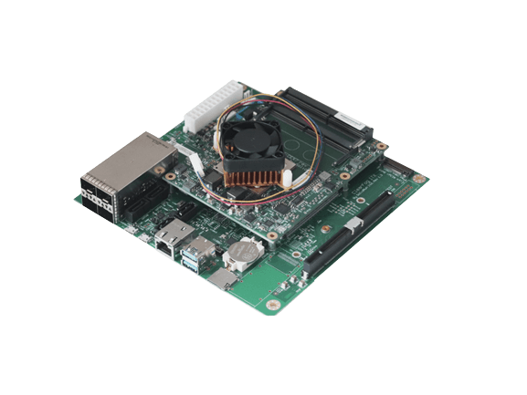

Connecting both builtin NICs and PCI-E NICs to DPDK at the same time, by running the below commands:

```bash
bash ./dpdk/nxp/dpaa2/dynamic_dpl.sh dpmac.7 dpmac.8 dpmac.9 dpmac.10
export DPRC=dprc.2
echo Y > /sys/module/vfio_pci/parameters/disable_idle_d3
./dpdk/usertools/dpdk-devbind.py --bind vfio-pci 01:00.*
./dpdk-build/app/dpdk-testpmd -c 0xffff -n 1 -a 01:00.0 -a 01:00.1 -- --txd=2048 --txpkts=1500 --tx-first --auto-start --forward-mode=txonly --total-num-mbufs=131072
```

[View device](https://shop.solid-run.com/product/SRLX216S00D00GE064H09CH)
